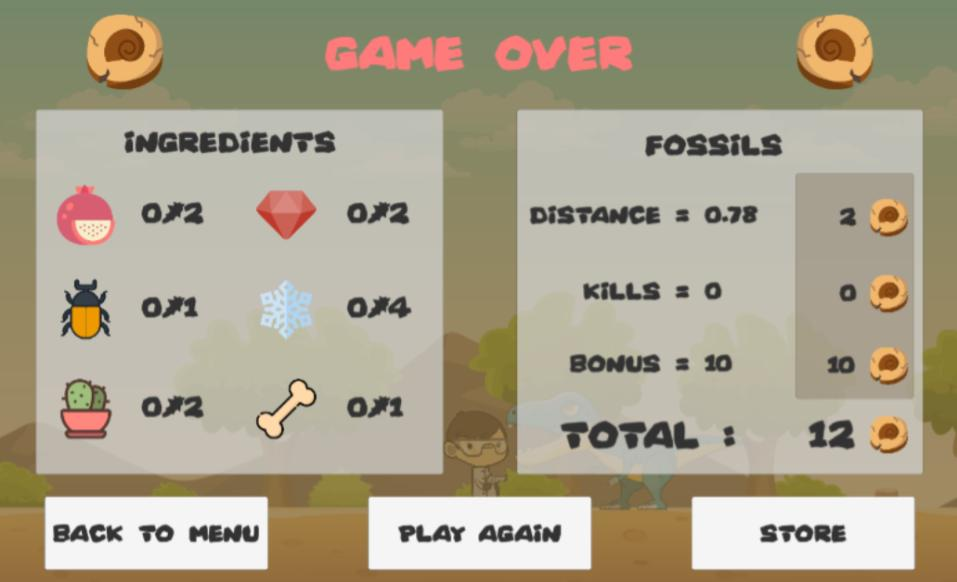
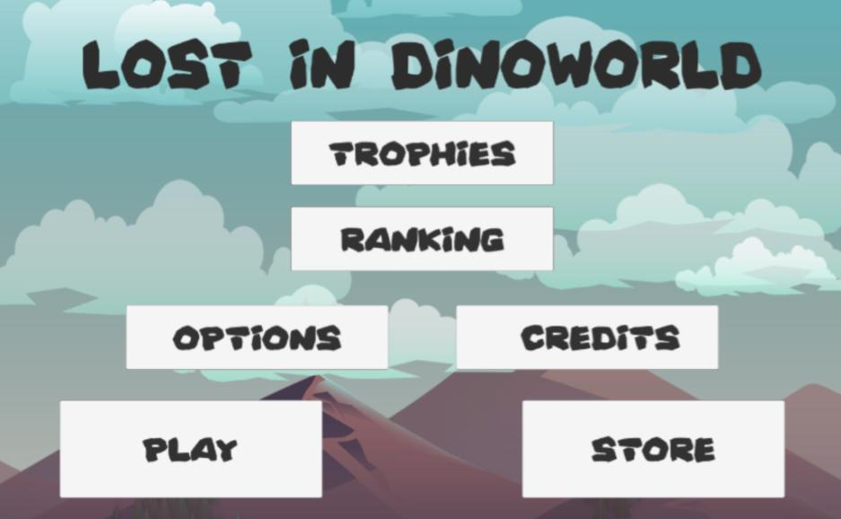
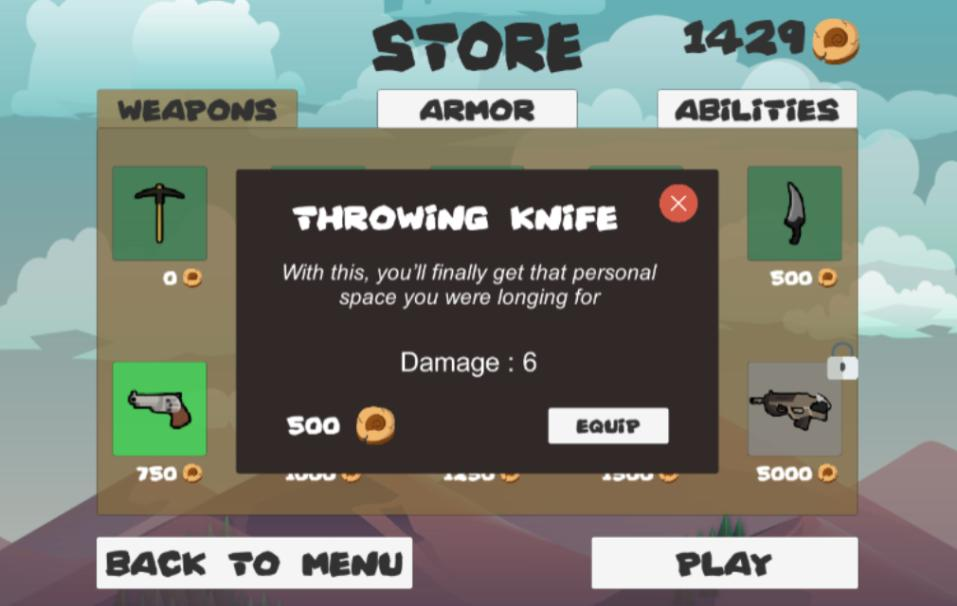

# Lost In DinoWorld

## Contexte du projet

Projet de 4 étudiants réalisé dans le cadre du cours « Principes de création de jeux vidéo » - UQAC Automne 2017

## Qu'est-ce « Lost In DinoWorld » ?

« Lost In DinoWord » est un jeu 2D tout public à l’ambiance cartoon conçu avec le moteur Unity. Ce jeu se classe parmi les 4 genres suivants :

  * Jeu d’aventure
  * Jeu de combat
  * Jeu de plateforme
  * Side scrolling (jeu à défilement horizontal)

### Synopsis

Un scientifique souhaite éradiquer le virus qui ravage la population humaine en 2150. Il est parvenu à trouver la formule de l’antidote. Le problème ? Les ingrédients nécessaires à cette formule n’existent qu’à l’époque des dinosaures ! Il décide alors de voyager dans le temps.

### Jeu

Le joueur, qui incarne le scientifique nouvellement arrivé à l’époque des dinosaures, va devoir parcourir un ensemble de six régions pour récolter les ingrédients tant convoités. Il pourra revenir en 2150 grâce au téléporteur présent à la sixième région. Malheureusement pour lui, des dinosaures peu dociles ainsi que des obstacles ralentiront sa course.

## Images

 
 
 
 

